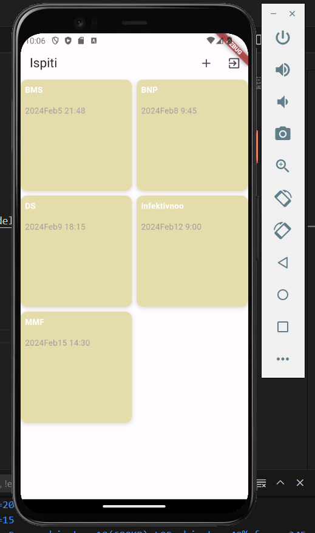
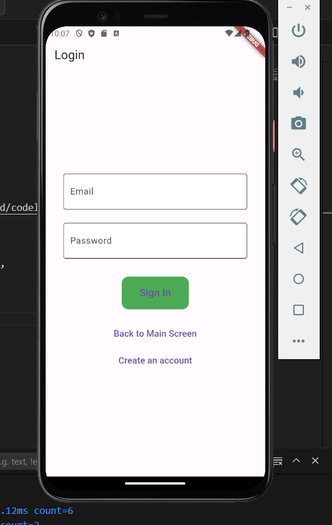
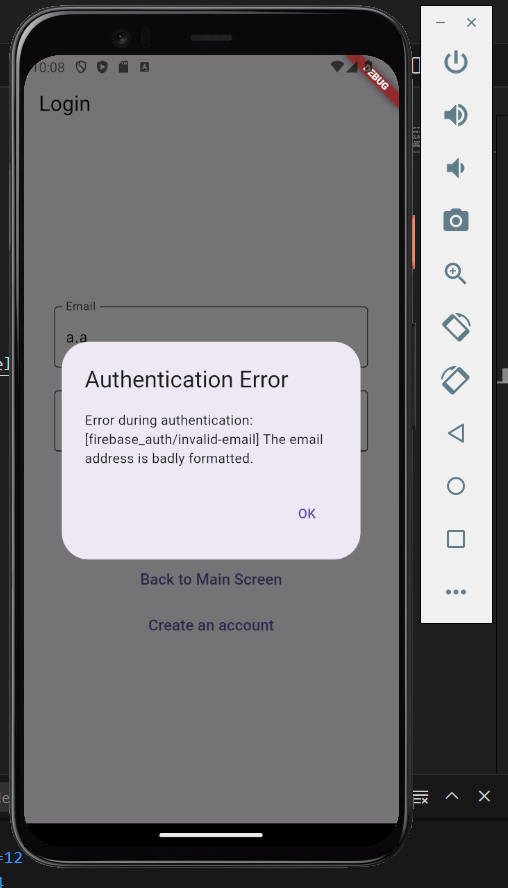
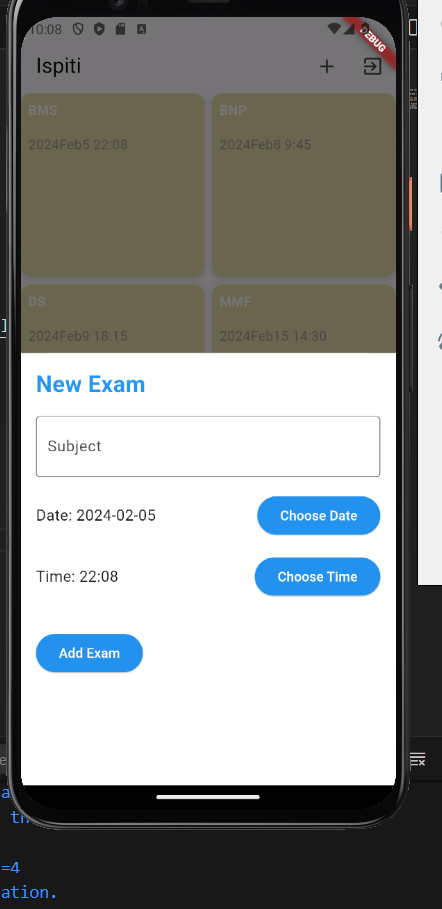
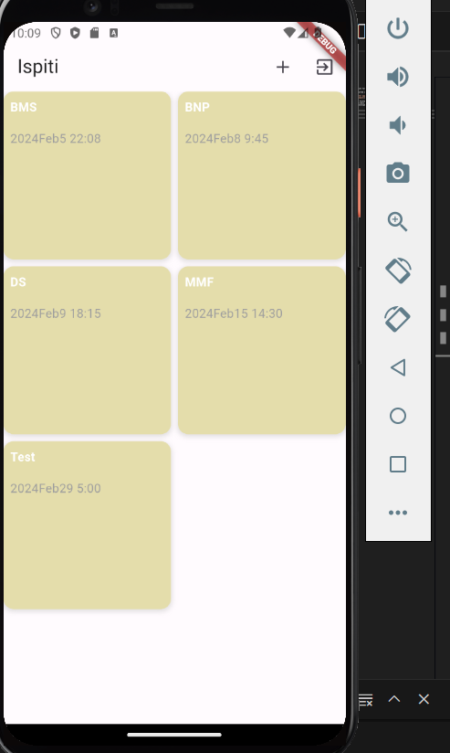
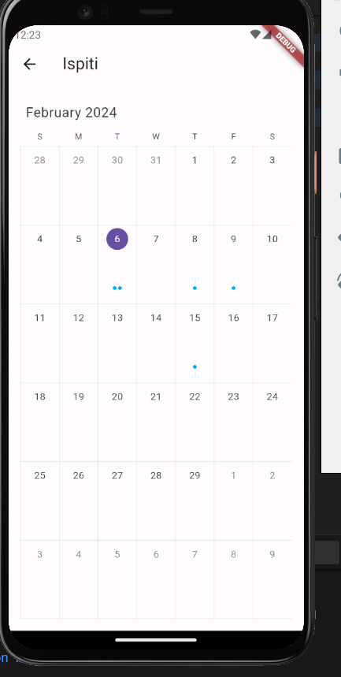
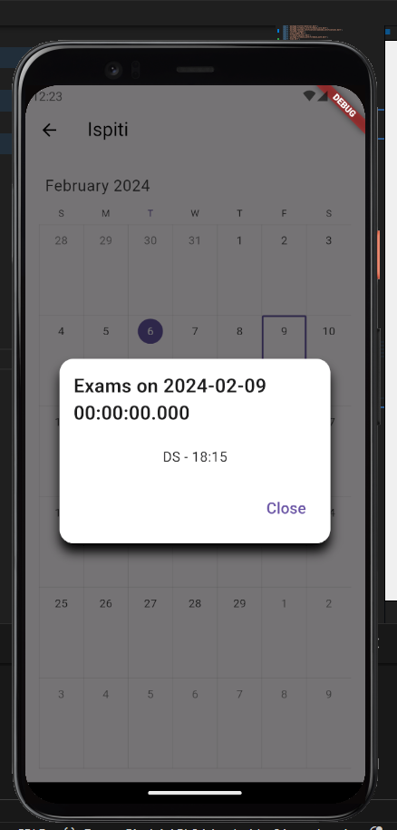
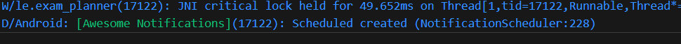
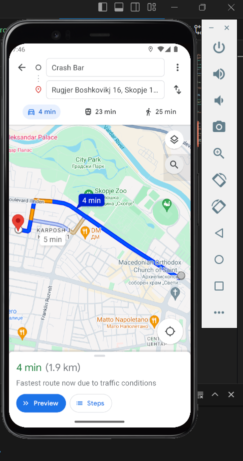
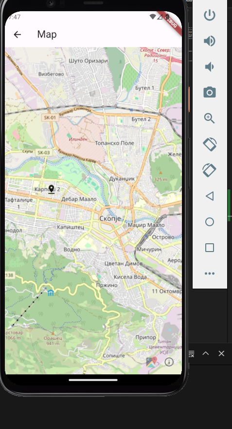

# exam_planner

A new Flutter project.

## Getting Started

This project is a starting point for a Flutter application.

A few resources to get you started if this is your first Flutter project:

- [Lab: Write your first Flutter app](https://docs.flutter.dev/get-started/codelab)
- [Cookbook: Useful Flutter samples](https://docs.flutter.dev/cookbook)

For help getting started with Flutter development, view the
[online documentation](https://docs.flutter.dev/), which offers tutorials,
samples, guidance on mobile development, and a full API reference.

Lab 3 Delot proverki za avtentikacija najava i dodavanje 

LAB 4 Delot dodaden kalendar so schedules i dodadeni notifikacii

LAB 5 
Rutiranje so pomosh na Google Maps direktno se prezema lokacijata na fakultetot vo end destination

Lokacijata na fakultetot

Lokaciski bazirani servisi

